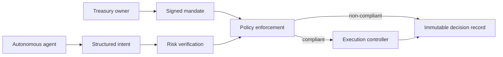

# Creance

Creance is a product prototype for policy-enforced treasury automation. It makes a distinction that matters: an agent may propose an action, but an independent mandate decides whether that action can execute.

The first interface prototype includes a reviewable rebalance intent, a live mandate control, clear rejection reasons, and a decision timeline. It models a policy-control experience, not a trading terminal.

The interface defaults to AMOLED dark mode. Use the `AMOLED` control in the top bar to switch themes. Liquid-glass treatment is limited to navigation and action chrome, while policy evidence remains opaque for contrast.

## Run locally

```powershell
npm install
npm run start
```

Open the local URL printed by Vite. Move the Stock Token ceiling to 45% or higher, select **Re-evaluate intent**, then approve the compliant intent. This simulates a newly signed mandate and does not interact with a network or wallet.

## Current scope

- Product-first interface prototype with no live chain integration.
- Static treasury and risk figures that illustrate the intended decision flow.
- Client-side policy simulation, including audit events generated during interaction.
- Responsive, keyboard-operable controls and reduced-motion support.
- Deterministic four-agent loop in `src/agenticLoop.js`, with a runnable demo and Node test coverage.
- Risk output labels verified sources separately from conservative heuristic signals.

## System design



## Project layout

```text
.
├── creance.md                   # Creance product and architecture brief
├── index.html                   # Application markup
├── src/
│   ├── main.js                  # Policy simulation and audit interactions
│   ├── agenticLoop.js           # Treasurer, Risk, Policy, and Executor loop
│   ├── demo.js                  # Scripted verification beats
│   └── styles.css               # Responsive visual system
├── test/
│   └── agenticLoop.test.js      # Deterministic loop and safety tests
├── DESIGN_MODE.md               # Pixasso visual and interaction contract
├── contracts/
│   ├── CreancePolicy.sol        # On-chain policy gate and audit events
│   └── README.md                # Off-chain to on-chain check mapping
├── package.json                 # Local development commands
└── code_review.md               # Implementation review
```

## Next build phase

1. Replace static fixtures with a versioned policy schema and deterministic evaluator.
2. Connect an authenticated owner flow for signed mandate updates and delegated-role revocation.
3. Add verified price and risk data adapters, distinguishing source-backed data from heuristic signals.
4. Bind `CreancePolicy.sol` to an execution controller and add deployment tests after the target network and oracle path are selected.
5. Persist the audit trail with transaction references and event integrity checks.

## Agentic loop verification

```powershell
node src/demo.js
npm test
```

The loop currently reproduces the five required outcomes from `AGENTIC_LOOP_SPEC.md`. It uses a no-op executor by default, accepts an injected executor, and drives the browser timeline. The browser and Solidity layers remain separate until a versioned policy schema, verified accounting, and a chain adapter are finalized.
