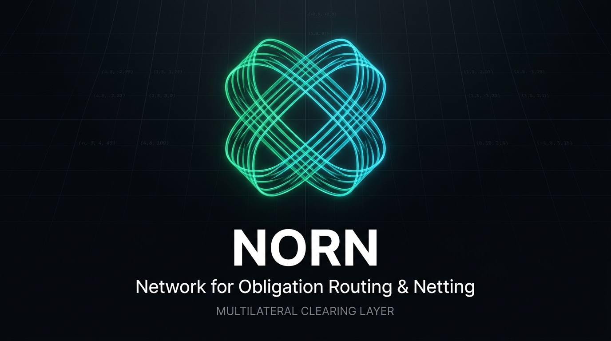
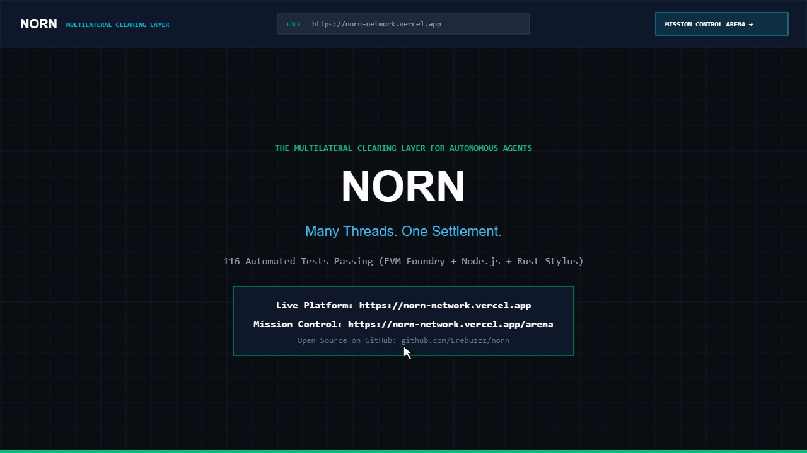
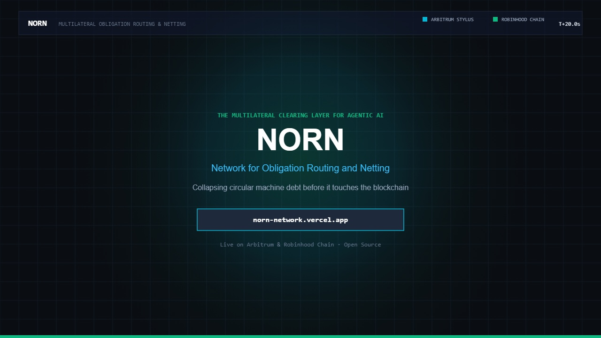
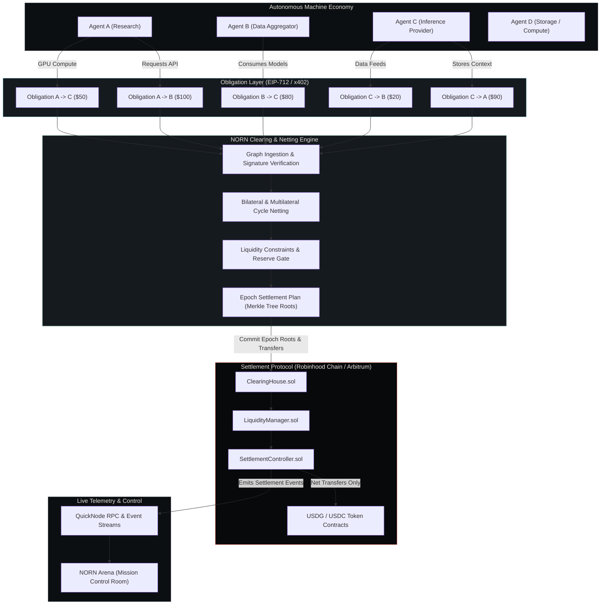
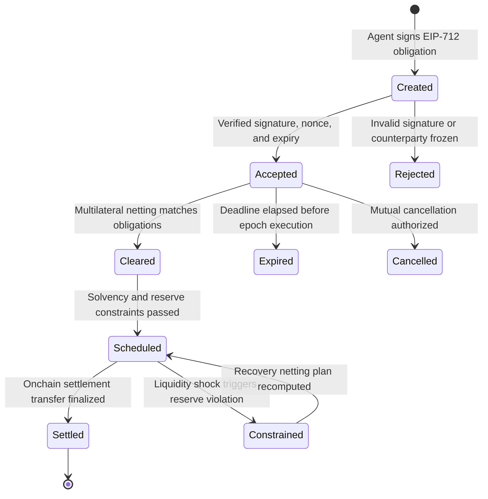

<p align="center">
  
</p>

# NORN: Network for Obligation Routing & Netting

Multilateral clearing and liquidity layer for autonomous machine payments.

[](https://norn-network.vercel.app)
[](https://norn-network.vercel.app/arena)
[](https://docs.arbitrum.io)
[](https://docs.robinhood.com/chain/)
[](LICENSE)

* **Live Platform & Visualizer**: [https://norn-network.vercel.app](https://norn-network.vercel.app)
* **Mission Control Arena**: [https://norn-network.vercel.app/arena](https://norn-network.vercel.app/arena)
* **Source Repository**: [https://github.com/Erebuzzz/norn](https://github.com/Erebuzzz/norn)

```text
Many threads. One settlement.
```

---

## Video Demonstrations

### 1. Full Platform Demo & Walkthrough (60 Seconds)

> Comprehensive interactive demonstration of the live 2.5D Loom Canvas, Participant Node inspector, Mission Control Arena, interactive unweaving scrubber, Genesis Crisis -40% liquidity shock, and dual-chain settlement on Arbitrum Stylus and Robinhood Chain.

<p align="center">
  <a href="assets/norn-demo.webm" title="Watch Full Platform Demo">
    
  </a>
</p>

<p align="center">
  <em>Click image above or open <a href="assets/norn-demo.webm"><code>assets/norn-demo.webm</code></a> to watch the 60-second interactive platform demo.</em>
</p>

### 2. Cinematic Launch Video (/brag)

> 20-second cinematic overview of NORN obligation unweaving, cycle canceling, and sub-second settlement on Arbitrum Stylus and Robinhood Chain.

<p align="center">
  <a href="assets/norn-launch.webm" title="Watch NORN Launch Video">
    
  </a>
</p>

<p align="center">
  <em>Click image above or open <a href="assets/norn-launch.webm"><code>assets/norn-launch.webm</code></a> to watch the 20-second launch video.</em>
</p>

---

## Executive Summary

Autonomous agents, machine APIs, and micro-services create thousands of continuous, small economic obligations. Today, each interaction either triggers an independent onchain transaction or relies on closed bilateral payment channels. In a dense machine economy, settling every obligation independently causes excessive transaction overhead, high peak liquidity requirements, and systemic liquidity fragmentation.

NORN decouples obligation creation from onchain settlement:

```text
Obligation → Clear → Net → Settle
```

AI agents create cryptographically signed payment obligations (via EIP-712 or x402 commitments). NORN aggregates these obligations across the entire network, runs deterministic multilateral netting algorithms subject to solvency and reserve constraints, and settles the minimal necessary net balance on Arbitrum and Robinhood Chain.

---

## Architectural Overview



---

## Obligation Lifecycle



---

## Mathematical Foundations of Netting

For any participant $i$ in a clearing epoch with counterparty set $J$:

### Gross Obligation Volume
$$G = \sum_{i,j} O_{i \to j}$$

### Net Settlement Position
$$Net_i = \sum_{j} O_{j \to i} - \sum_{j} O_{i \to j}$$

### Conservation Invariant
$$\sum_{i} Net_i = 0$$

### Liquidity and Solvency Bounds
For every participant $i$, the required debit must satisfy available liquidity and approved credit lines:
$$Debit_i \le AvailableLiquidity_i + ApprovedCredit_i$$

Post-settlement liquidity must strictly preserve the mandatory reserve threshold:
$$PostLiquidity_i = AvailableLiquidity_i - Debit_i \ge RequiredReserve_i$$

---

## Monorepo Layout

```text
norn/
├── apps/
│   ├── arena/              # NORN Arena: Financial Mission-Control Room & Crisis Simulator
│   ├── web/                # NORN Landing: Protocol documentation and visual Loom experience
│   └── api/                # High-throughput clearing engine and service orchestration API
├── contracts/              # Production Solidity contracts (Foundry)
│   ├── ClearingHouse.sol
│   ├── EmergencyController.sol
│   ├── LiquidityManager.sol
│   ├── NORNParticipantRegistry.sol
│   ├── ObligationRegistry.sol
│   ├── RiskController.sol
│   └── SettlementController.sol
├── packages/
│   ├── agents/             # Agent runtime and reference agent actors
│   ├── chain/              # EVM client bindings (viem, wagmi, contracts ABI)
│   ├── clearing/           # Graph cycle cancellation and multilateral netting engine
│   ├── config/             # Shared constants, tokens, and chain parameters
│   ├── machine-payments/   # x402 and typed obligation protocol adapters
│   ├── quicknode/          # QuickNode RPC, Streams, and event normalization
│   ├── risk/               # Dynamic risk regime engine (NORMAL, CONSTRAINED, DEFENSIVE, FROZEN)
│   ├── robinhood/          # Robinhood Chain client and Stock Token / USDG adapters
│   ├── sdk/                # @norn/sdk developer client library
│   ├── simulation/         # Deterministic economic simulator (Genesis Crisis)
│   └── ui/                 # Design system tokens and Loom visualization components
├── services/               # Real machine micro-services producing live obligations
│   ├── compute/
│   ├── data/
│   ├── inference/
│   ├── search/
│   └── weather/
├── stylus/                 # Arbitrum Stylus Rust programs for compute-heavy verification
│   ├── risk-functions/
│   └── stress-engine/
├── tests/                  # Fuzz, invariant, and integration test suites
└── docs/                   # Specifications, architecture, and competitive intelligence
```

---

## Getting Started

### Prerequisites
- Node.js >= 20.0.0
- pnpm >= 9.0.0
- Foundry (`forge`, `cast`, `anvil`)
- Rust and Cargo (for Stylus crates)

### Installation
```bash
git clone https://github.com/Erebuzzz/norn.git
cd norn
pnpm install
```

### Running Tests
```bash
# Run unit and invariant tests across all packages
pnpm test

# Run Solidity smart contract tests with Foundry
forge test -vvv
```

### Running NORN Arena
```bash
pnpm dev:arena
```

---

## Documentation & Developer Resources

Complete technical documentation, architecture specifications, and deployment runbooks are located in `docs/`:

- [System Architecture](file:///docs/ARCHITECTURE.md): Full mechanism breakdown, contracts, and Mermaid diagrams.
- [Competitive Positioning](file:///docs/COMPETITIVE_POSITIONING.md): Comparative analysis versus existing Open House submissions and x402 batch scheme.
- [Deployment Guide](file:///docs/DEPLOYMENT.md): Step-by-step rollout on Robinhood Chain and Arbitrum Sepolia.
- [Judge Walkthrough & Demo](file:///docs/DEMO.md): 3-minute demo script and Arena mission control runbook.
- [Paxos USDG Integration](file:///docs/USDG_INTEGRATION.md): Settlement asset adapter, decimals, and safety bounds.
- [Robinhood Chain Integration](file:///docs/ROBINHOOD_INTEGRATION.md): Network parameters, Stock Tokens, and RWA collateral haircuts.
- [Stylus Compute Layer](file:///docs/STYLUS_ARCHITECTURE.md): Rust fixed-point math and numerical stress engine.
- [Ecosystem Resources & Faucets](file:///docs/RESOURCES.md): Quick reference to official docs, faucets, RPCs, ZeroDev, and Stylus tools.

---

## Deployment & Verification

NORN contracts are designed for Robinhood Chain and Arbitrum Sepolia testnets.
Consult `docs/DEPLOYMENT.md` for deterministic deployment scripts, verification keys, and RPC configuration.

---

## License, Privacy & Security

- **License:** Open source under the [MIT License](LICENSE).
- **Privacy Policy:** Read our zero-PII architectural privacy commitment in [PRIVACY.md](PRIVACY.md).
- **Security Policy:** Read our invariant security model and vulnerability disclosure protocol in [SECURITY.md](SECURITY.md).

