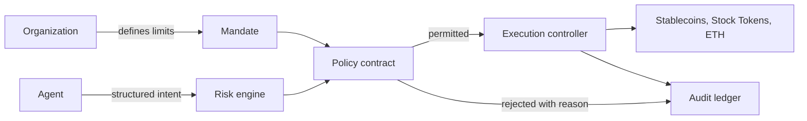

# Creance

**One-liner:** An autonomous treasury that can act, but cannot break its mandate.

## The problem

Most AI treasury products conflate a decision with authority to act. That leaves organizations with an unacceptable choice: fully trust an agent with capital, or require a human to execute every action manually.

Creance separates those concerns. An organization defines an enforceable mandate, an agent proposes an action, an independent risk engine checks it, and a policy contract permits execution only when every constraint holds.

## Product thesis

> Organization defines policy → agent proposes → risk engine verifies → policy contract enforces → execution occurs only within the mandate.

The agent is replaceable. The policy contract is the product. This is treasury infrastructure for operational liquidity and capital efficiency, not an AI investment manager and not an alpha-generation product.

## Product position

| Product | Core role |
| --- | --- |
| Tilt Protocol | Onchain investment funds |
| Agama | Stock Token collateral for private credit |
| Weave | Automated Stock Token basket rebalancing |
| **Creance** | **Enforceable governance for a machine managing treasury capital** |

## Architecture



### Intelligence layer

- **Treasurer:** proposes allocation changes.
- **Risk officer:** assesses volatility, concentration, drawdown, depeg, and liquidity risk.
- **Policy officer:** validates an intent against the mandate before submission.
- **Executor:** turns an approved intent into an onchain action.

The product interface presents the observable decision record: why, what, risk, policy result, and transaction reference. It does not expose agent deliberation as chat.

### Enforcement layer

The policy contract re-verifies non-negotiable limits independently of the submitting agent:

```text
Exposure_asset   ≤ L_asset
Exposure_issuer  ≤ L_issuer
Exposure_chain   ≤ L_chain
RiskScore        ≥ R_min
Liquidity        ≥ L_min
DailySpend       ≤ B_daily
```

If a condition fails, execution reverts. The agent may produce an invalid intent, but it cannot override the mandate.

### Execution and audit layer

```text
Policy Contract → Execution Controller → Asset Venue → Transaction → Audit Event
```

Every decision writes an event: `ProposalCreated → PolicyChecked → RiskVerified → ApprovalRequested → ApprovalGranted or Rejected → TradeExecuted → PolicyUpdated → EmergencyFreeze`.

The treasury owner never shares a private key with an agent. Each delegated role carries a spending limit, asset allowlist, expiry, and maximum exposure, and can be revoked immediately.

## Asset universe, V1

- **Stablecoins:** USDC, USDT where supported.
- **Stock Tokens:** AAPL, MSFT, NVDA, AMZN, plus a supported ETF-style token.
- **Native asset:** ETH.

## Risk data boundary

Price feeds and market data must be identified by source before production use. Stablecoin depeg, liquidity, and correlation signals require an explicitly labelled heuristic component until they are supplied by a verified data source. No placeholder signal should be presented as live data.

## First interactive prototype

The prototype demonstrates a complete policy loop:

1. Start with a $1M treasury and a 30% Stock Token ceiling.
2. Evaluate a proposal to purchase $150K of AAPL.
3. Show the exact policy rejection because the resulting 45% exposure breaches the ceiling.
4. Adjust the mandate ceiling to 50% and re-evaluate the same proposal.
5. Approve the now-compliant intent and write the result into the audit timeline.
