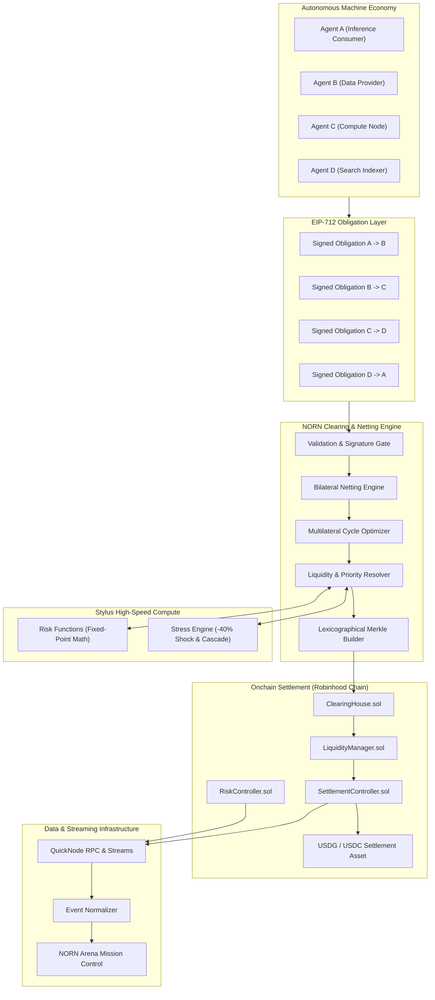
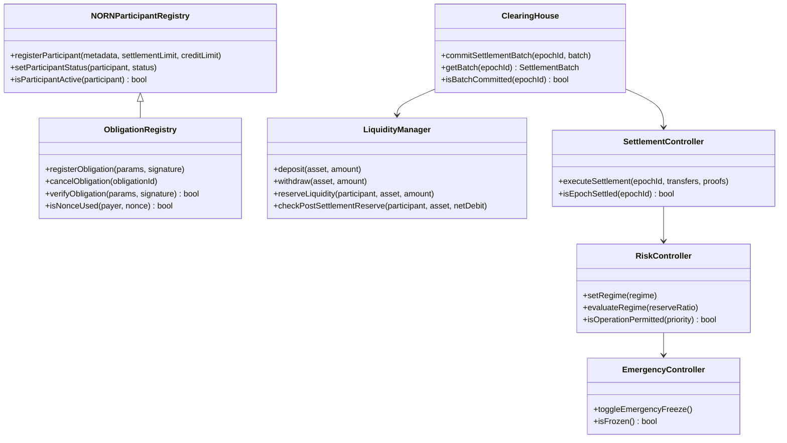
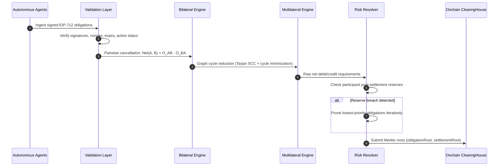

# NORN Protocol Architecture

## 1. System Overview

NORN (Network for Obligation Routing & Netting) is a multilateral clearing and liquidity management protocol purpose-built for autonomous machine-to-machine economies.

Modern AI agents and autonomous micro-services generate high volumes of micro-transactions. Routing each payment as an immediate independent onchain transfer is financially inefficient, consumes excessive gas, and fragments capital. 

NORN replaces unbatched micro-transfers with a core clearing cycle:

```text
Obligation -> Clear -> Net -> Settle
```

AI agents create cryptographically signed economic obligations using EIP-712 structured data. The NORN clearing engine aggregates obligations, cancels bilateral and multilateral debt cycles, schedules settlements subject to participant liquidity and risk regimes, and submits cryptographic Merkle commitments and net transfers onchain.



---

## 2. The Loom Metaphor

NORN's design philosophy is centered on **The Loom**: a mythic, high-precision industrial system that weaves chaos into order.

- **Threads**: Signed economic obligations flowing between autonomous agents.
- **Knots**: Economic participants and network counterparties holding liquidity.
- **Convergence**: Clearing windows where incoming and outgoing obligations intersect.
- **Compression**: Multilateral netting reducing gross obligation volumes into minimal net balances.
- **Final Path**: Atomic onchain settlement transferring only the net delta.

---

## 3. Smart Contract Suite

The protocol contracts are deployed on Robinhood Chain with Arbitrum compatibility, compiled under Solidity 0.8.24.



### 3.1 `NORNParticipantRegistry.sol`
Tracks participant lifecycle states (`ACTIVE`, `CONSTRAINED`, `FROZEN`), metadata URI hashes, settlement volume limits, and authorized credit lines.

### 3.2 `ObligationRegistry.sol`
Verifies EIP-712 structured data signatures onchain. Features strict replay protection via deterministic nonces (`isNonceUsed[payer][nonce]`), status transitions (`CREATED` -> `CLEARED` -> `SETTLED`), and cancellation guards.

### 3.3 `ClearingHouse.sol`
Manages clearing epochs and receives Merkle roots:
- `obligationRoot`: Merkle root of all obligations included in the clearing window.
- `participantNetRoot`: Merkle root of participant balance adjustments.
- `settlementRoot`: Merkle root of final executable transfers.

### 3.4 `LiquidityManager.sol`
Enforces the conservation of value and dynamic reserve ratio rules:
- Tracks `depositedLiquidity`, `reservedLiquidity`, and `settledVolume`.
- Evaluates `reserveRatio = (deposited - reserved) / deposited`.
- Reverts with `PostSettlementReserveBreach(participant, required, actual, shortfall)` if a proposed settlement would violate minimum reserves.

### 3.5 `SettlementController.sol`
Performs atomic batch settlements:
- Validates Merkle membership proofs against the ClearingHouse commitment.
- Checks total conservation: `sum(credits) == sum(debits)`.
- Prevents double-settlement per epoch.
- Executes low-level ERC-20 transfers for Paxos USDG or USDC.

### 3.6 `RiskController.sol`
Maintains protocol risk regimes:
- `NORMAL` (Reserve Ratio >= 30%): All obligation priorities processed.
- `CONSTRAINED` (Reserve Ratio 20% to 30%): Deferred obligations paused.
- `DEFENSIVE` (Reserve Ratio 10% to 20%): Only Critical and High priorities cleared.
- `FROZEN` (Reserve Ratio < 10%): Settlement halted; circuit breakers active.

### 3.7 `EmergencyController.sol`
Global circuit breaker providing immediate halts in case of upstream oracle anomalies, extreme market depegs, or security warnings.

---

## 4. Clearing & Netting Engine

The offchain engine operates in five sequential phases:



1. **Validation**: Rejects expired obligations, invalid signatures, duplicate nonces, and frozen counterparties.
2. **Bilateral Offsetting**: Calculates pairwise net balances between counterparties.
3. **Multilateral Cycle Elimination**: Detects directed cycles ($A \to B \to C \to A$) and eliminates circulating debt up to the minimum edge weight in each cycle.
4. **Liquidity & Risk Resolver**: Checks each participant's projected post-settlement balance against reserve requirements. If a participant breaches limits, lower-priority obligations are pruned until reserve invariants are satisfied.
5. **Merkle Commitment Builder**: Generates deterministic, sorted-pair Merkle trees compatible with OpenZeppelin `MerkleProof`.

---

## 5. Arbitrum Stylus Compute Layer

For computationally intensive numerical calculations, NORN deploys Rust modules to Arbitrum Stylus:

- **`risk-functions`**: High-performance WAD (1e18) fixed-point math for reserve ratios, haircut adjustments, and shortfall bounds.
- **`stress-engine`**: Fast matrix simulation applying -40% liquidity shocks to participant pools, evaluating systemic contagion, and recovering optimal pruned settlement paths in sub-millisecond execution times.

---

## 6. QuickNode Data Pipeline

NORN leverages QuickNode infrastructure for resilient, enterprise-grade ingestion:
- **Resilient RPC Client**: Automatic exponential backoff, jitter, configurable timeouts, and failover health checks.
- **QuickNode Streams**: Ingests `SettlementExecuted`, `RiskRegimeChanged`, and `ObligationRegistered` events.
- **Normalization Layer**: Deduplicates logs via composite key `${chainId}-${txHash}-${logIndex}` and records block checkpoints for safe stream resumption after network interruptions.

---

## 7. Robinhood Chain & USDG Settlement

Robinhood Chain serves as the primary execution environment:
- **Canonical Asset Adapters**: First-class support for Paxos USDG (`USDGAdapter`) and Circle USDC (`USDCAdapter`).
- **Testnet Fallback Safeguards**: Clear identification of mock contracts (`isMock() == true`) to prevent misrepresentation.
- **RWA Collateral Model**: Optional Stock Token collateral valuation applying strict haircuts:
  $$\text{EffectiveCollateral} = \text{MarketValue} \times \text{Haircut} \times \text{LiquidityFactor} \times \text{StateFactor}$$
  where StateFactor is zero during trading halts to prevent toxic liquidations.
