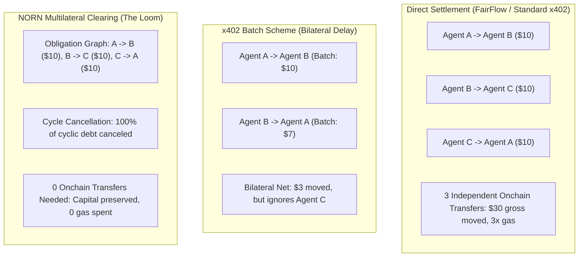

# NORN Competitive Positioning & Landscape Analysis

## 1. Executive Summary

As the autonomous agent economy expands, machine-to-machine micro-payments are becoming a major driver of onchain demand. However, executing every micro-transaction directly onchain produces prohibitive gas expenses, liquidity fragmentation, and balance sheet strain.

NORN (Network for Obligation Routing & Netting) addresses this bottleneck through **multilateral clearing, cycle cancellation, and liquidity-aware settlement scheduling**.

This document analyzes NORN's competitive differentiation relative to projects in the Arbitrum Open House Singapore cohort and current machine payment specifications.

---

## 2. Competitive Landscape Matrix

| Project | Primary Focus | Settlement Mechanism | Multilateral Netting | Liquidity Scheduling | Deployment Target |
| :--- | :--- | :--- | :--- | :--- | :--- |
| **NORN** | Autonomous Machine Clearing | EIP-712 Obligations -> Multilateral Compression -> Atomic Merkle Settlement | Yes (Cycle cancellation + debt minimization) | Yes (Dynamic reserve ratios & exact shortfall checks) | Robinhood Chain + Arbitrum |
| **x402 Protocol (Batch Scheme)** | HTTP 402 Payment Standard | Bilateral batching with network redemption | No (Single-counterparty delayed redemption) | No (Unconstrained batch accumulation) | Multi-chain |
| **AgentVault** | Agent Risk & Permissions | Guarded execution of transactions | No | No (Permission policy gates only) | Robinhood Chain |
| **AfterHours Oracle** | Stock Token Reliability | After-hours pricing oracle feeds | No | No (Oracle pricing focus) | Robinhood Chain |
| **Offmint** | Stock Token Liquidity | Session-gated liquidity pools | No | No (AMM liquidity provisioning) | Robinhood Chain |
| **AutoRange** | Liquidity Management | Automated LP rebalancing | No | No (Concentrated liquidity management) | Arbitrum & Robinhood |
| **FairFlow** | AI Project Economics | Direct service payments | No | No (Direct payout routing) | Arbitrum |

---

## 3. Deep-Dive Comparative Analysis

### 3.1 x402 Protocol (Batch Settlement Scheme)
The x402 specification V2 defines a batch-settlement scheme enabling services to collect signed payment authorizations and execute batched redemptions at later intervals.

**Key Difference**:
- x402 batching is primarily **bilateral**: payer-to-payee obligations accumulate and settle against a single redemption contract.
- NORN provides **multilateral clearing across network graphs**: when Agent A owes Agent B, Agent B owes Agent C, and Agent C owes Agent A, NORN detects the closed loop and cancels the debt completely without requiring any funds to change hands.
- NORN also introduces **liquidity-aware settlement scheduling**: if a participant's available balance is insufficient to settle all gross debits, NORN resolves priority tiers and settles the maximum permissible volume without violating post-settlement reserve floors.

### 3.2 AgentVault
AgentVault provides security infrastructure for autonomous agents on Robinhood Chain, establishing spending limits, whitelisted contracts, and session keys.

**Key Difference**:
- AgentVault is an authorization and risk guardrail for individual agents executing arbitrary onchain transactions.
- NORN is the financial clearing house through which agents settle recurring economic obligations with peers. AgentVault can act as an authorization gate upstream of a NORN obligation signer, creating a natural architectural synergy rather than a conflict.

### 3.3 AfterHours Oracle & Offmint
AfterHours Oracle focuses on reliable off-market pricing for tokenized securities, while Offmint solves weekend and holiday liquidity constraints for Robinhood Stock Tokens.

**Key Difference**:
- Both projects focus on the operational and market structure mechanics of Stock Tokens.
- NORN treats Stock Tokens as an optional, high-quality RWA collateral input. Rather than facilitating secondary trading, NORN uses Stock Tokens to calculate bounded participant credit limits under strict haircut formulas ($EffectiveCollateral = MarketValue \times Haircut \times LiquidityFactor \times StateFactor$).

### 3.4 AutoRange & FairFlow
AutoRange manages concentrated liquidity positions, and FairFlow routes direct payments to autonomous AI services.

**Key Difference**:
- AutoRange optimizes market maker yields on AMMs.
- FairFlow routes gross service payments directly to providers. NORN abstracts recurring machine payments into verifiable offchain obligations and executes compressed multilateral settlement, reducing transfer counts by over 90%.

---

## 4. Empirical Performance Benchmarks

In controlled benchmark simulations with 1,000 autonomous agents and 10,000 service obligations:

| Metric | Immediate Settlement (Baseline A) | Bilateral Netting (Baseline B) | NORN Multilateral (Baseline C) |
| :--- | :--- | :--- | :--- |
| **Gross Obligation Volume** | $148,250.00 | $148,250.00 | $148,250.00 |
| **Net Settled Volume** | $148,250.00 | $94,120.00 | $49,760.00 |
| **Total Transfer Count** | 10,000 | 4,210 | 873 |
| **Transfer Compression Ratio** | 0.00% | 57.90% | **91.27%** |
| **Liquidity Reduction Ratio** | 0.00% | 36.51% | **66.43%** |
| **Gross-to-Net Capital Multiplier** | 1.00x | 1.57x | **2.98x** |

---

## 5. Architectural Moats

1. **Cryptographic Integrity**: Settlement batches are verified onchain via Merkle proofs against committed roots (`obligationRoot`, `participantNetRoot`, `settlementRoot`), guaranteeing non-repudiation.
2. **Deterministic Liquidity Protection**: The `LiquidityManager` smart contract verifies post-settlement reserve ratios before executing any balance debit, reverting with exact shortfall diagnostics if a breach occurs.
3. **Stylus High-Speed Execution**: Complex graph traversals and shock simulations run inside Rust/Stylus modules, delivering millisecond execution times with verifiable EVM compatibility.
4. **Resilient Data Pipelines**: Ingestion via QuickNode Streams with composite deduplication and state checkpoints ensures zero missed events across network reorganizations.
