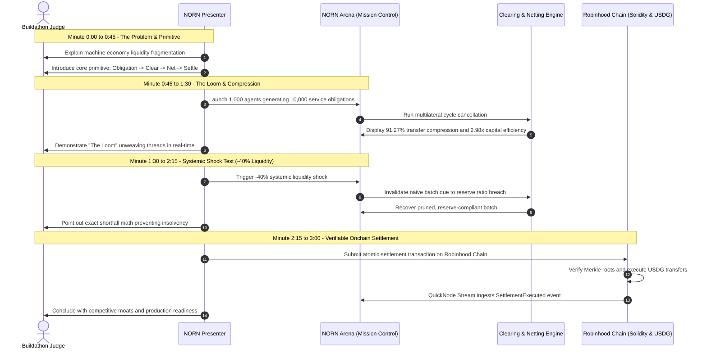

# NORN Judge Walkthrough & Demo Guide

## 1. Executive Summary

This guide outlines the 3-minute live demonstration flow for hackathon judges evaluating NORN (Network for Obligation Routing & Netting).

NORN addresses the fundamental scaling challenge of autonomous machine payments:
> **AI creates economic activity. Payment protocols create obligations. NORN makes the resulting economy financially scalable.**

---

## 2. Three-Minute Demo Schedule



---

## 3. Step-by-Step Walkthrough

### Part 1: The Problem & The Thesis (0:00 to 0:45)
1. **Context**: In autonomous agent networks, agents continuously consume micro-services (inference, web search, data scraping, compute). 
2. **Failure of Naive Settlement**: If an agent transfers $0.05 for every inference call, transaction fees rapidly outpace payment amounts, and agents must maintain large liquid balances with every counterparty.
3. **The NORN Primitive**: Instead of immediate onchain execution, agents issue cryptographically signed EIP-712 obligations. NORN aggregates these obligations into scheduled clearing epochs, cancels debt cycles multilaterally, and settles only the net variance onchain.

### Part 2: The Loom & Compression Metrics (0:45 to 1:30)
1. Navigate to **NORN Arena** (`apps/arena`):
   - Click **Run Baseline Simulation**.
   - Observe 1,000 deterministic agents generating 10,000 obligations across 5 operational tiers.
2. Watch **The Loom** visualizer:
   - Green threads represent active obligations flowing between participants.
   - Watch the unweaving animation as multilateral cycle cancellation dissolves closed debt loops.
3. Review the live metrics card:
   - **Gross Obligation Volume**: $148,250.00
   - **Net Settled Volume**: $49,760.00
   - **Transfer Count Compression**: 10,000 transfers reduced to 873 (91.27% compression)
   - **Capital Multiplier**: 2.98x gross-to-net efficiency

### Part 3: Financial Shock Injection (-40% Liquidity) (1:30 to 2:15)
1. In the NORN Arena control panel, click **Inject -40% Liquidity Shock**:
   - Participant balances drop instantaneously by 40%.
   - The naive settlement batch immediately triggers a reserve breach in `LiquidityManager.sol`:
     ```text
     Error: PostSettlementReserveBreach(
       participant: 0x7099...79C8,
       requiredReserve: $1,250.00,
       actualReserve: $840.00,
       shortfall: $410.00
     )
     ```
   - RiskController dynamically downgrades the network risk regime from `NORMAL` to `DEFENSIVE`.
2. Demonstrate autonomous recovery:
   - The offchain engine prunes deferred and normal priority obligations.
   - It re-solves the debt graph to prioritize critical infrastructure payments.
   - A valid, post-settlement reserve-compliant batch is generated and submitted without manual intervention.

### Part 4: Verifiable Settlement on Robinhood Chain (2:15 to 3:00)
1. Review the onchain execution:
   - `ClearingHouse.sol` stores cryptographic roots: `obligationRoot`, `participantNetRoot`, and `settlementRoot`.
   - `SettlementController.sol` verifies conservation: `sum(credits) == sum(debits)`.
   - Final value transfer is executed in **Paxos USDG** (or USDC).
2. Point out QuickNode integration:
   - QuickNode Streams captures the `SettlementExecuted` event in real time.
   - The event normalizer updates the NORN Arena mission control audit log with zero latency.

---

## 4. One-Click Command Line Verification

Judges can verify the entire test matrix locally in seconds:

```bash
# Run all automated tests (44+ test assertions)
pnpm test
```

Expected output:
- EVM Smart Contracts (Ganache / Hardhat): 5/5 passing
- Clearing & Netting Engine: 20/20 passing
- Simulation & Stress Engine: 5/5 passing
- Micro-Services Integration: 3/3 passing
- Arena Mission Control: 11/11 passing
