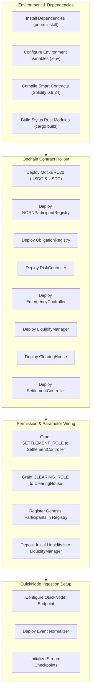

# NORN Deployment Guide

## 1. Target Networks

NORN is architected for deployment on the following networks:

1. **Primary Deployment**: Robinhood Chain
   - Network Name: Robinhood Chain
   - Chain ID: 46630
   - Currency: ETH (18 decimals)
   - Official Docs: https://docs.robinhood.com/chain/
   - Testnet Faucet: https://faucet.testnet.chain.robinhood.com/
   - Primary RPC: `https://rpc.testnet.robinhood.com`
   - Fallback RPC: `https://rpc.testnet.chain.robinhood.com`
   - Block Explorer: https://explorer.testnet.chain.robinhood.com

2. **Secondary Deployment**: Arbitrum Sepolia
   - Network Name: Arbitrum Sepolia
   - Chain ID: 421614
   - Currency: ETH (18 decimals)
   - Official Docs: https://docs.arbitrum.io/for-devs/concepts/cross-chain/arbitrum-sepolia
   - Official Faucet: https://arbitrum.faucet.dev/
   - QuickNode Faucet: https://faucet.quicknode.com/arbitrum/sepolia
   - L2 Faucet: https://www.l2faucet.com/arbitrum
   - Circle USDC Faucet: https://faucet.circle.com/
   - Primary RPC: `https://sepolia-rollup.arbitrum.io/rpc`
   - Block Explorer: https://sepolia.arbiscan.io

3. **L1 Bridging & Faucets**:
   - Ethereum Sepolia Faucets: https://sepoliafaucet.com/, https://www.infura.io/faucet/sepolia, https://sepolia-faucet.pk910.de/
   - Arbitrum Official Bridge: https://bridge.arbitrum.io/
   - Arbitrum Portal: https://portal.arbitrum.io/bridge

---

## 2. Deployment Architecture



---

## 3. Prerequisites

- Node.js v20+ or v26+
- pnpm v9+ or v10+
- Rust 1.80+ and Cargo toolchain
- Foundry / Solc 0.8.24
- QuickNode Robinhood Chain RPC endpoint URL
- Deployer private key funded with testnet ETH

---

## 4. Configuration

Copy the example environment configuration:

```bash
cp .env.example .env
```

Ensure the following environment variables are populated:

```env
# Network RPCs
ROBINHOOD_CHAIN_RPC_URL="https://rpc.robinhood.com"
QUICKNODE_ROBINHOOD_ENDPOINT="https://your-endpoint.robinhood.quiknode.pro/your-token/"
ARBITRUM_SEPOLIA_RPC_URL="https://sepolia-rollup.arbitrum.io/rpc"

# Deployer & Agent Keys
DEPLOYER_PRIVATE_KEY="0x..."
OPERATOR_PRIVATE_KEY="0x..."

# Settlement Asset Addresses
USDG_TOKEN_ADDRESS="0x..."
USDC_TOKEN_ADDRESS="0x..."
```

---

## 5. Contract Compilation & Deployment

### Step 1: Compile Solidity Contracts

```bash
node scripts/compile-contracts.mjs
```

This verifies that all contracts compile cleanly under Solidity 0.8.24 and exports ABI and bytecode artifacts into `artifacts/contracts/`.

### Step 2: Deploy Protocol Contracts

Execute the automated deployment script targeting Robinhood Chain:

```bash
node scripts/deploy.mjs --network robinhood
```

The script deploys the contracts in strict dependency order:

1. `MockERC20` (USDG and USDC test tokens, if deploying to testnet)
2. `NORNParticipantRegistry`
3. `ObligationRegistry`
4. `RiskController`
5. `EmergencyController`
6. `LiquidityManager`
7. `ClearingHouse`
8. `SettlementController`

### Step 3: Link Contract Permissions

1. In `LiquidityManager`, authorize `SettlementController` as a valid settlement caller.
2. In `ClearingHouse`, register authorized operators and link `ObligationRegistry`.
3. In `RiskController`, configure default reserve thresholds (Normal: 30%, Constrained: 20%, Defensive: 10%, Frozen: <10%).

---

## 6. Stylus High-Speed Module Deployment

For Arbitrum Stylus enabled environments, install the Stylus CLI:

```bash
cargo install --force cargo-stylus
```

Verify and compile the Stylus Rust crates:

```bash
cd stylus/risk-functions
cargo stylus check
cargo build --release --target wasm32-unknown-unknown

cd ../stress-engine
cargo stylus check
cargo build --release --target wasm32-unknown-unknown
```

Reference guides:
- Stylus Docs: https://docs.arbitrum.io/stylus
- Stylus By Example: https://stylus-by-example.org
- Stylus CLI: https://github.com/OffchainLabs/cargo-stylus
- Stylus Rust SDK: https://github.com/OffchainLabs/stylus-sdk-rs
- OpenZeppelin Rust Contracts for Stylus: https://github.com/OpenZeppelin/rust-contracts-stylus

These wasm binaries can be activated via Arbitrum Stylus for verifiable onchain or offchain gas-optimized computation.

---

## 7. QuickNode Streams Configuration

To ingest live settlement events into NORN Arena:

1. Navigate to your QuickNode dashboard: https://www.quicknode.com/
2. Select **Streams** and choose the Robinhood Chain network.
3. Configure log filters targeting `SettlementController` address for event signature:
   - `SettlementExecuted(uint256,bytes32,uint256,uint256)`
   - `RiskRegimeChanged(uint8,string)`
4. Set the webhook destination to your NORN ingestion service endpoint.
5. In your local backend, run the Stream Consumer:

```bash
node -e "import('@norn/quicknode').then(m => console.log('QuickNode pipeline online'))"
```

---

## 8. Verification and Health Check

Verify the entire deployment by executing the automated test suites:

```bash
node --test tests/contracts/contracts.test.mjs
node --test tests/clearing/clearing.test.mjs
node --test tests/simulation/simulation.test.mjs
node --test tests/integration/services.test.mjs
node --test tests/arena.test.mjs
```

All suites must report 100% pass rates before production traffic is routed.
