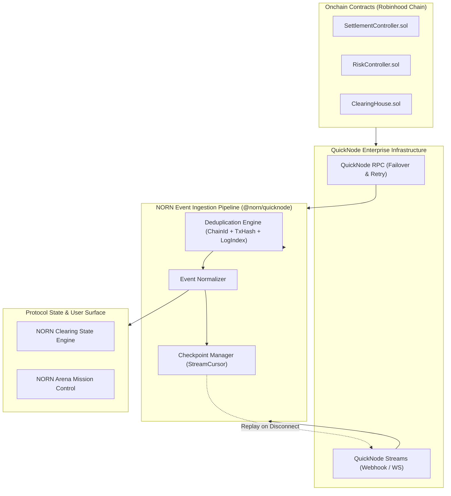

# QuickNode Data & Streaming Infrastructure

## 1. Executive Summary

QuickNode serves as the primary blockchain data infrastructure for the NORN protocol on Robinhood Chain and Arbitrum.

In an autonomous machine economy where thousands of obligations are settled across scheduled epochs, real-time observability and resilient event ingestion are paramount. NORN utilizes QuickNode RPC endpoints for verifiable onchain queries and QuickNode Streams for low-latency, reorg-aware settlement event feeds.



---

## 2. Infrastructure Architecture

The `@norn/quicknode` package implements three core components:

### 2.1 Resilient RPC Client (`QuickNodeClient`)
Standard public RPC nodes frequently suffer from rate limits, connection timeouts, and intermittent dropped packets. The `QuickNodeClient` wraps Viem's `PublicClient` with:
- **Exponential Backoff with Jitter**: Automatically retries transient RPC errors with randomized backoff delays to prevent thundering herd problems.
- **Configurable Timeouts & Retries**: Custom retry thresholds for read queries vs critical transaction receipts.
- **Active Health Monitoring**: Regular `checkHealth()` heartbeats verifying block heights and peer connectivity.

### 2.2 Event Normalizer (`EventNormalizer`)
Raw blockchain logs contain disparate formats and unparsed topics. The `EventNormalizer` decodes ABI parameters from NORN smart contracts and maps them to a canonical schema:

```ts
export interface ChainEvent {
  chainId: number;
  blockNumber: bigint;
  txHash: `0x${string}`;
  logIndex: number;
  contract: `0x${string}`;
  eventName: string;
  args: Record<string, unknown>;
  observedAt: string;
}
```

### Supported Event Types
- `SettlementExecuted(uint256 epochId, bytes32 settlementRoot, uint256 transferCount, uint256 totalAmount)`
- `RiskRegimeChanged(uint8 newRegime, string reason)`
- `ObligationRegistered(bytes32 id, address payer, address payee, uint256 amount)`
- `LiquidityDeposited(address participant, address asset, uint256 amount)`
- `EmergencyFreezeToggled(bool isFrozen)`

### 2.3 Stream Consumer & Deduplication Engine (`StreamConsumer`)
Network reorganizations and stream reconnections can re-emit previously processed logs. To guarantee exact-once processing semantics:
1. **Composite Deduplication Key**:
   $$\text{EventKey} = \text{chainId} + \text{"-"} + \text{txHash} + \text{"-"} + \text{logIndex}$$
2. **In-Memory LRU Ring Buffer**: Remembers recent event keys to filter duplicates instantly.
3. **Stream Checkpointing**: Maintains persistent cursors (`StreamCheckpoint`) tracking the last successfully processed block and transaction hash, allowing clean replay from the point of failure.

---

## 3. Configuration & Security Guidelines

In accordance with section 20 of the NORN Build Plan:
- **Zero Browser Credential Exposure**: QuickNode API keys and private RPC endpoints must never be bundled into client-side web application code.
- **Server-Side Proxy**: NORN Arena and web frontends consume normalized event state via backend WebSocket feeds or server-side API routes, shielding QuickNode authentication tokens.
- **Failover RPC URL**: A secondary backup RPC provider is configured to activate if the primary QuickNode endpoint reports consecutive health check failures.
