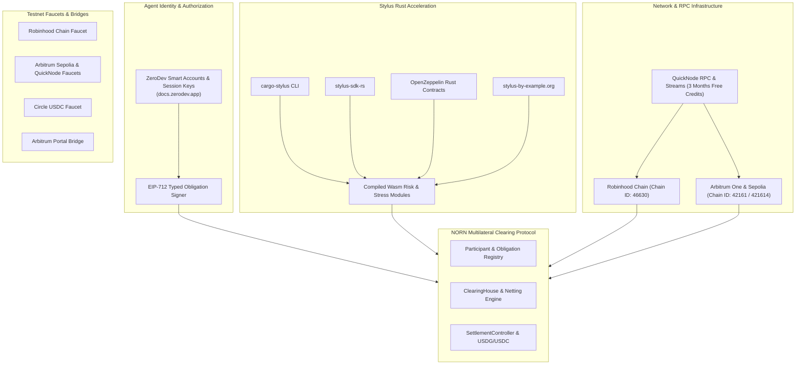

# NORN Ecosystem Reference & Developer Resources

## 1. Executive Summary

This directory documents the official developer infrastructure, toolchains, RPC networks, oracles, faucets, and SDKs utilized by NORN (Network for Obligation Routing & Netting) across Robinhood Chain and Arbitrum environments.

---

## 2. Network Documentation & Core Guides

### Robinhood Chain
- **Official Documentation**: https://docs.robinhood.com/chain/
- **Connecting & Network Setup**: https://docs.robinhood.com/chain/connecting/
- **Smart Contract Deployment**: https://docs.robinhood.com/chain/deploy-smart-contracts/
- **Canonical Contracts Discovery**: https://docs.robinhood.com/chain/contracts/
- **Stock Tokens Specification**: https://docs.robinhood.com/chain/stock-tokens/
- **Stock Token APIs**: https://docs.robinhood.com/chain/stock-token-apis/

### Arbitrum Technology Stack
- **Arbitrum Introduction**: https://docs.arbitrum.io/get-started/arbitrum-introduction
- **Solidity Quickstart with Remix**: https://docs.arbitrum.io/build-decentralized-apps/quickstart-solidity-remix
- **Arbitrum Oracles Map**: https://docs.arbitrum.io/for-devs/oracles/oracles-content-map
- **Arbitrum Nitro Local Dev Node**: https://docs.arbitrum.io/run-arbitrum-node/run-nitro-dev-node
- **Arbitrum SDK**: https://github.com/OffchainLabs/arbitrum-sdk
- **Arbitrum Portal Bridge**: https://portal.arbitrum.io/bridge
- **Arbitrum Official Bridge**: https://bridge.arbitrum.io/

---

## 3. Account Abstraction & ZeroDev Session Keys

In autonomous agent payment networks, safeguarding master keys while enabling high-frequency obligation issuance is critical.

- **ZeroDev Documentation**: https://docs.zerodev.app/
- **Use in NORN**:
  Autonomous agents can deploy ZeroDev ERC-4337 smart accounts and issue scoped session keys. A session key can be restricted to signing EIP-712 payment obligations with a strict cumulative cap and expiration window, preventing total treasury exposure if an individual micro-service runtime is compromised.

---

## 4. Arbitrum Stylus Rust Toolchain

Stylus enables writing gas-efficient, near-native smart contracts and numerical engines in Rust:

- **Stylus Gentle Introduction**: https://docs.arbitrum.io/stylus/gentle-introduction
- **Stylus Developer Quickstart**: https://docs.arbitrum.io/stylus/quickstart
- **Official Stylus Documentation**: https://docs.arbitrum.io/stylus
- **Stylus By Example**: https://stylus-by-example.org
- **Cargo Stylus CLI**: https://github.com/OffchainLabs/cargo-stylus
- **Stylus Rust SDK**: https://github.com/OffchainLabs/stylus-sdk-rs
- **OpenZeppelin Rust Contracts for Stylus**: https://github.com/OpenZeppelin/rust-contracts-stylus
- **OpenZeppelin Solidity Contracts**: https://github.com/OpenZeppelin/openzeppelin-contracts

In NORN, Stylus powers `stylus/risk-functions` (WAD fixed-point math and reserve checks) and `stylus/stress-engine` (fast matrix simulation of -40% liquidity shocks).

---

## 5. Testnet Faucets

### Robinhood Chain
- **Robinhood Chain Testnet Faucet**: https://faucet.testnet.chain.robinhood.com/

### Arbitrum Sepolia
- **Arbitrum Developer Faucet**: https://arbitrum.faucet.dev/
- **QuickNode Arbitrum Sepolia Faucet**: https://faucet.quicknode.com/arbitrum/sepolia
- **L2Faucet Arbitrum**: https://www.l2faucet.com/arbitrum
- **Circle USDC Faucet**: https://faucet.circle.com/

### Ethereum Sepolia (L1 for Bridging)
- **Sepolia Faucet**: https://sepoliafaucet.com/
- **Infura Sepolia Faucet**: https://www.infura.io/faucet/sepolia
- **PoW Sepolia Faucet**: https://sepolia-faucet.pk910.de/
- **Arbitrum Bridge**: https://bridge.arbitrum.io/

---

## 6. RPC Endpoints

### Arbitrum One (Mainnet)
- `https://arb1.arbitrum.io/rpc`
- `https://rpc.ankr.com/arbitrum`
- `https://arbitrum.llamarpc.com`

### Robinhood Chain (Testnet)
- `https://rpc.testnet.robinhood.com`
- `https://rpc.testnet.chain.robinhood.com`

### QuickNode Enterprise Infrastructure
- **Documentation**: https://www.quicknode.com/docs
- **Robinhood Chain Support**: https://www.quicknode.com/chains/robinhood
- **Streams & SQL Explorer**: https://www.quicknode.com/docs/streams
- **Open House Singapore Support**: QuickNode is supporting buildathon developers with three months of complimentary QuickNode enterprise credits for high-throughput RPC and event stream pipelines.
