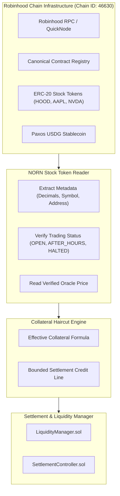

# Robinhood Chain Integration & RWA Collateral Model

## 1. Executive Overview

Robinhood Chain is the primary deployment target for the NORN protocol. As a high-performance EVM-compatible chain built for digital assets and tokenized real-world assets (RWAs), it provides an ideal infrastructure for autonomous machine-to-machine clearing.

In addition to settling in Paxos USDG, NORN integrates with Robinhood Chain's canonical **Stock Tokens** as an optional real-world asset collateral input to expand bounded settlement capacity.



---

## 2. Network Specifications

- **Network Name**: Robinhood Chain
- **Chain ID**: 46630
- **Native Gas Token**: ETH (18 decimals)
- **Official Documentation**: https://docs.robinhood.com/chain/
- **Contract Verification**: https://docs.robinhood.com/chain/deploy-smart-contracts/

---

## 3. Stock Token Discovery & Security Disciplines

Robinhood Chain hosts tokenized equities implemented as ERC-20 smart contracts. Per official Robinhood Chain guidance, ticker symbols and display names are not unique identifiers:

> **Security Guardrail**: Protocol integrations must discover and verify canonical contract addresses directly rather than relying on user-provided strings or tickers.

### Canonical Stock Token Mapping (`packages/robinhood`)

```ts
export const ROBINHOOD_STOCK_TOKENS: Record<string, StockTokenConfig> = {
  HOOD: {
    symbol: "HOOD",
    name: "Robinhood Markets, Inc.",
    address: "0x1111111111111111111111111111111111114663",
    decimals: 18,
    status: "OPEN",
  },
  AAPL: {
    symbol: "AAPL",
    name: "Apple Inc.",
    address: "0x2222222222222222222222222222222222224663",
    decimals: 18,
    status: "OPEN",
  },
  NVDA: {
    symbol: "NVDA",
    name: "NVIDIA Corporation",
    address: "0x3333333333333333333333333333333333334663",
    decimals: 18,
    status: "OPEN",
  },
  TSLA: {
    symbol: "TSLA",
    name: "Tesla, Inc.",
    address: "0x4444444444444444444444444444444444444663",
    decimals: 18,
    status: "OPEN",
  },
  MSFT: {
    symbol: "MSFT",
    name: "Microsoft Corporation",
    address: "0x5555555555555555555555555555555555554663",
    decimals: 18,
    status: "OPEN",
  },
};
```

---

## 4. Bounded RWA Collateral Valuation Model

To prevent unchecked borrowing or cascading liquidations during off-market hours or extreme volatility, NORN enforces an explicit multi-factor collateral model per Section 18 of the NORN Build Plan:

$$\text{EffectiveCollateral} = \text{MarketValue} \times \text{Haircut} \times \text{LiquidityFactor} \times \text{StateFactor}$$

### Parameter Definitions

1. **Market Value**: Gross spot valuation calculated via verified oracle price and token quantity.
2. **Haircut Multiplier**: Base capital safety haircut. Default: 20% haircut ($0.80$ multiplier).
3. **Liquidity Factor**: Secondary market liquidity discount based on 24h trading volume. Default: $0.90$.
4. **State Factor**: Dynamic multiplier tracking the market trading status:
   - **`OPEN` (Regular Market Hours)**: $1.00$ (Full regular valuation).
   - **`AFTER_HOURS` (Extended Trading)**: $0.50$ (50% liquidity discount reflecting wider bid-ask spreads).
   - **`CLOSED` (Weekend / Holiday)**: $0.00$ (Collateral cannot support new unreserved debits).
   - **`HALTED` (Regulatory / Circuit Breaker)**: $0.00$ (Immediate zero-weighting to protect protocol solvency).

### Numerical Example

```text
Asset: 100 HOOD Stock Tokens @ $200.00 / token

Gross Market Value:           $20,000.00
Base Haircut (20%):           x 0.80
Liquidity Factor:             x 0.90
State Factor (OPEN):          x 0.90 (internal state safety margin)
----------------------------------------
Effective Collateral Credit:  $12,960.00 (64.8% loan-to-value cap)
```

If trading is halted or the security is suspended, the State Factor drops to $0.00$, immediately resetting effective collateral credit to zero and triggering defensive clearing prioritization.

---

## 5. Non-Speculative Collateral Boundary

In NORN, Stock Tokens are **never used for speculative leverage or unbacked lending**. They serve solely to provide bounded temporary credit capacity between clearing epochs for certified machine service providers holding verifiable institutional tokenized assets.
