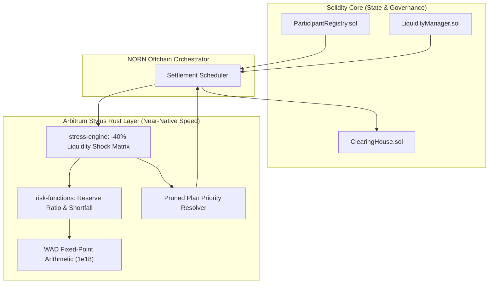

# Stylus Rust High-Speed Compute Layer

## 1. Rationale & Architecture

Arbitrum Stylus introduces the ability to write smart contracts and verifiable computational routines in Rust, compiling down to WebAssembly (Wasm) that executes on Arbitrum nodes with near-native performance.

Per Section 23 of the NORN Build Plan, Rust is deployed selectively where there is a genuine computational advantage rather than forcing simple token transfers into Rust:

```text
Solidity (Onchain Source of Truth)
├── ParticipantRegistry.sol (Ownership & status)
├── ObligationRegistry.sol  (EIP-712 signature verification)
├── ClearingHouse.sol       (Epoch Merkle commitments)
├── LiquidityManager.sol    (Balance tracking & reserve invariants)
├── SettlementController.sol(Conservation & batch transfers)
└── EmergencyController.sol (Circuit breakers)

Rust / Stylus (High-Speed Numerical Compute)
├── risk-functions          (WAD fixed-point risk mathematics)
└── stress-engine           (Systemic shock & cascade simulation)
```



---

## 2. Risk Functions Crate (`stylus/risk-functions`)

The `risk-functions` crate provides deterministic, overflow-safe mathematical primitives utilizing standard 18-decimal fixed-point (WAD) arithmetic:

### Core Functions

1. **`calculate_reserve_ratio(deposited: u128, reserved: u128) -> u128`**
   Computes the participant's unencumbered liquidity ratio:
   $$\text{ReserveRatio} = \frac{(\text{Deposited} - \text{Reserved}) \times 10^{18}}{\text{Deposited}}$$
   Safely handles edge cases ($Deposited == 0$ returns zero ratio without panics).

2. **`calculate_shortfall(net_debit: u128, available_liquidity: u128) -> u128`**
   Computes the exact capital deficiency if a participant attempts to settle more debt than their available post-reserve liquidity allows.

3. **`determine_regime(reserve_ratio_wad: u128) -> RiskRegime`**
   Evaluates system health against protocol risk thresholds:
   - `NORMAL`: Ratio $\ge 30\%$ ($0.30 \times 10^{18}$)
   - `CONSTRAINED`: $20\% \le$ Ratio $< 30\%$
   - `DEFENSIVE`: $10\% \le$ Ratio $< 20\%$
   - `FROZEN`: Ratio $< 10\%$

4. **`apply_haircut(amount: u128, haircut_bps: u32) -> u128`**
   Calculates discounted asset valuations with basis-point precision ($10,000 \text{ bps} = 100\%$).

5. **`verify_conservation(credits: &[u128], debits: &[u128]) -> bool`**
   Verifies the fundamental clearing invariant: the exact sum of all credited funds must equal the exact sum of all debited funds.

---

## 3. Stress Engine Crate (`stylus/stress-engine`)

The `stress-engine` crate simulates extreme financial scenarios across networks with thousands of nodes:

### Features

1. **Systemic Liquidity Shock Simulation**:
   Applies an instantaneous $-40\%$ haircut across all participant balances, simulating bank runs or market-wide margin calls.
2. **Cascade Vulnerability Detection**:
   Traverses the obligation graph to detect participants whose post-shock balances breach the minimum reserve threshold, identifying contagion pathways before they materialize onchain.
3. **Automated Batch Pruning**:
   When a shock causes settlement invalidation, the engine dynamically prioritizes obligations by seniority (Critical > High > Normal > Nettable > Deferred) and prunes lower tiers until the remaining batch satisfies all post-settlement reserve constraints.

---

## 4. Performance & Compilation

Rust code is compiled with standard release optimizations:

```toml
[profile.release]
opt-level = "z"
lto = true
codegen-units = 1
panic = "abort"
```

Unit and invariant test suites are validated natively via Cargo:

```bash
cargo test --all
```
