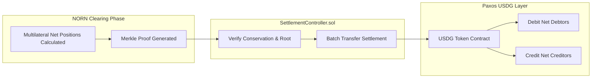

# Paxos USDG Settlement Asset Integration

## 1. Overview

The Arbitrum Open House Singapore Buildathon gives explicit priority consideration to projects integrating **Paxos USDG**. In autonomous agent payment networks, settlement finality requires a regulated, yield-bearing, and high-integrity dollar stablecoin.

NORN designates USDG as its primary settlement asset. When clearing epochs conclude, the net debit and credit balances computed by the NORN netting engine are finalized onchain using USDG token transfers.



---

## 2. Settlement Asset Adapter Architecture

To guarantee flexibility and robust unit testing, NORN defines a polymorphic `SettlementAssetAdapter` interface in `packages/robinhood`:

```ts
export interface SettlementAssetAdapter {
  symbol(): string;
  address(): `0x${string}`;
  decimals(): number;
  balanceOf(account: `0x${string}`): Promise<bigint>;
  transfer(to: `0x${string}`, amount: bigint): Promise<`0x${string}`>;
  isMock(): boolean;
}
```

### Supported Adapters

1. **`USDGAdapter`**: Production adapter interacting directly with the canonical Paxos USDG ERC-20 contract.
2. **`MockUSDGAdapter`**: Testnet and local development fallback. Strictly labeled as `TESTNET_MOCK_USDG` to prevent false representation.
3. **`USDCAdapter`**: Fallback secondary stablecoin adapter for Circle USDC.
4. **`MockUSDCAdapter`**: Testnet fallback for USDC.

---

## 3. Strict Mainnet vs Testnet Discipline

In compliance with section 19 and section 55 of the NORN Build Plan:

1. **No False Claims**: If a deployment environment or local testbed lacks the canonical Paxos USDG contract, the replacement is explicitly tagged:
   ```ts
   class MockUSDGAdapter implements SettlementAssetAdapter {
     isMock(): boolean {
       return true;
     }
     symbol(): string {
       return "TESTNET_MOCK_USDG";
     }
   }
   ```
2. **Deterministic Decimals**: USDG typically utilizes 6 decimals (or 18 depending on specific EVM deployment standard). The adapter dynamically fetches decimals directly from the token contract (`IERC20Metadata.decimals()`) and normalizes internal WAD (1e18) obligation amounts without precision loss:
   $$\text{RawAmount} = \frac{\text{WadAmount} \times 10^{\text{Decimals}}}{10^{18}}$$

---

## 4. Onchain Settlement Execution

Onchain settlement is executed via `SettlementController.sol`:

```solidity
function executeSettlement(
    uint256 epochId,
    SettlementTransfer[] calldata transfers,
    bytes32[][] calldata merkleProofs
) external nonReentrant {
    require(!epochSettled[epochId], "Epoch already settled");
    
    uint256 totalDebits = 0;
    uint256 totalCredits = 0;
    
    for (uint256 i = 0; i < transfers.length; i++) {
        SettlementTransfer memory t = transfers[i];
        
        // Verify transfer membership in ClearingHouse settlementRoot
        bytes32 leaf = keccak256(abi.encode(t.debtor, t.creditor, t.asset, t.amount));
        require(MerkleProof.verify(merkleProofs[i], clearingHouse.getSettlementRoot(epochId), leaf), "Invalid Merkle proof");
        
        // Execute USDG transfer
        IERC20(t.asset).safeTransferFrom(t.debtor, t.creditor, t.amount);
        
        totalDebits += t.amount;
        totalCredits += t.amount;
    }
    
    require(totalDebits == totalCredits, "Conservation broken");
    epochSettled[epochId] = true;
    emit SettlementExecuted(epochId, clearingHouse.getSettlementRoot(epochId), transfers.length, totalDebits);
}
```

---

## 5. Liquidity Management & Reserve Protection

Before executing any USDG transfer, the `LiquidityManager.sol` contract confirms that each debtor maintains sufficient remaining balance to meet protocol reserve ratios:

$$\text{PostSettlementReserve} = \frac{\text{CurrentBalance} - \text{NetDebit}}{\text{CurrentBalance}}$$

If the resulting ratio breaches the required regime minimum (e.g. 30% under Normal regime), the settlement batch is rejected before any state changes occur, ensuring zero counterparty default contagion.
