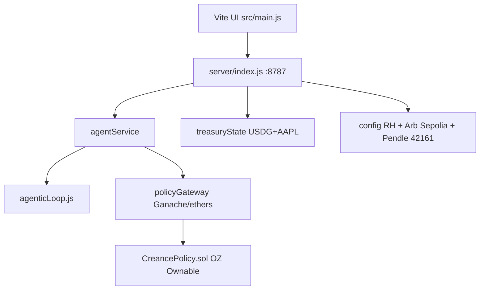

# Creance build context (agent handoff)

Last updated: 2026-09-18 (layout → **symmetric centered field**; blank-right fixed)
Phase: **Local policy demo SHIPPED** → Nordic AMOLED glass UI → layout lock = **symmetric** → next critical = **public deploy keys**

Authoritative strategy: `workflow/win-strategy.md` + `workflow/agent-handoff-strategy.yaml`  
Resources: `workflow/hackathon-resources-intel.md`  
Deploy runbook: `workflow/deploy-readiness.md`  
Gallery bar: `workflow/hackathon-gallery-intel.md` (Gage / INSTANT WIN / ETour = live deploy bar)  
Design handoff: `workflow/agent-handoff-design.yaml` (`pixasso.phase: signed_off`)

## User locks (do not regress)

| Lock | Locked value | Explicit NOT |
| --- | --- | --- |
| Layout (Q9 + override) | **Symmetric centered field** — equal 2-col grid on ~1160px canvas; airy vertical gap | NOT left-rail + empty right; NOT asymmetric stagger / island-left vs island-right offsets |
| Type (Q6) | **Nordic** — Sora (display) / Manrope (UI) / JetBrains Mono (proofs) | NOT Syne / Space Grotesk / Inter defaults |
| Theme + material (Q4/Q5) | **AMOLED** dark (`#000`/`#050505`) + verdant edge; **liquid glass** islands | NOT purple glass / warm cream terracotta |
| Logo (Q3) | Vault-gate SVG mark + CREANCE wordmark (`public/creance-mark.svg`, favicon) | — |

**Do NOT redesign further** unless functional/UX breakage (broken selectors, missing IDs). Keep symmetry lock.

Genome source: `workflow/design/design-genome.yaml` · Discovery: `workflow/design/discovery-questions.md`

## Agent lanes (this tick)

| Lane | Status | Notes |
| --- | --- | --- |
| Genome | **VALIDATED + overrides** | Locks above; `genome_validation_gate: PASSED` |
| Design / polish | **SIGNED OFF** | Sparse field + Nordic + AMOLED green glass + vault-gate logo. `remaining_polish: []` |
| Browser QA | **PASSED** 2026-09-18 | Full demo path desktop + ~390px smoke; no code fixes required |
| Reset sync | **LANDED** (agent 918ba267) | `POST /api/treasury/reset` → off-chain + on-chain mandate 0.3; 16 tests green |
| Build / local policy | **SHIPPED** | Ganache live txs; CAP_001 / mandate / approve / YIELD_005 |
| Public deploy | **BLOCKED** on user keys + faucet | **Next critical**; Arb Sepolia then RH; see `deploy-readiness.md` |
| Gallery intel | **COMPLETE** | `agent-handoff-gallery.yaml` |

## Browser QA results (2026-09-18)

Servers: API `:8787` (already up) · Vite `http://127.0.0.1:5180/` (bound `--host 127.0.0.1`; older Vite instances may bind `::1` only).

| Beat | Result | Evidence |
| --- | --- | --- |
| Theme toggle light + AMOLED dark | **PASS** | light `--bg0 #d5ddd8`; dark `--bg0 #000000`; `#themeToggle` / `#themeLabel` OK |
| Evaluate ~$150k AAPL → CAP_001 + tx/proof | **PASS** | Blocked / CAP_001 / `#reasonTx` 0x… |
| Raise ceiling → re-eval → approve | **PASS** | 50% MANDATE tx → AWAITING_HUMAN → CLEAR / Executed + TradeExecuted tx |
| Pendle full-stage → YIELD_005 | **PASS** | badge YIELD_005 + `#pendleTx` 0x… |
| Audit timeline with hashes | **PASS** | Policy checked + Approval rejected rows with 0x titles |
| ~390px smoke | **PASS** | no horizontal overflow; islands ~362px; Sora on brand; IDs intact; no crushed controls |

Fixes applied: **none** (no selector/ID breakage after layout refactor).

Reset behavior: `POST /api/treasury/reset` restores off-chain state **and** re-syncs on-chain mandate to default equity ceiling (0.3) when the policy gateway is live, so CAP_001 works again without restarting the API.

## Product rule

No hackathon/buildathon language in product UI/copy. Policy control plane, not AI allocator.

## Architecture (current)



| Piece | Status |
| --- | --- |
| `CreancePolicy.sol` + OZ Ownable | Compiled (`npm run compile`), `submitDecision` non-revert reject path, yield cap, delegates |
| Local live txs | **SHIPPED** via Ganache in-process (`policyGateway.js`) |
| CAP_001 $150k AAPL reject + txHash | **SHIPPED** + browser QA PASS |
| Raise ceiling → AWAITING_HUMAN → approve + TradeExecuted tx | **SHIPPED** + browser QA PASS |
| Pendle oversized → YIELD_005 + txHash | **SHIPPED** + browser QA PASS |
| USDG in portfolio / UI | **SHIPPED** |
| Cold Vault UI | **SIGNED OFF** — sparse field / Nordic / AMOLED glass / vault-gate |
| `scripts/deploy-policy.mjs` | **Added** — fails clearly if RPC/key unset; no secrets in repo |
| ZeroDev model stub | Documented stand-in; real Project ID not wired |
| Robinhood Chain deploy | **Blocked on user secrets** |
| Arb Sepolia deploy | **Blocked on user secrets** |
| Explorer-linked URLs | Ready when `CREANCE_EXPLORER_BASE` set; local mode shows hashes without explorer |

## Demo path (3 min) — local proof (done)

```bash
cd D:\Creance
npm run compile
npm run api          # boots Ganache + deploys CreancePolicy
npm start            # UI proxies /api (or: npx vite --host 127.0.0.1 --port 5180)
# OR headless:
npm run demo:chain
```

Expected: REJECT CAP_001 + tx → mandate 50% + tx → approve + TradeExecuted tx → optional Pendle YIELD_005 + tx.

## Blocked on user secrets (public explorer deploy)

Do **not** invent or commit real private keys. User must provide locally (shell / gitignored `.env` only):

| Need | Why |
| --- | --- |
| Funded testnet `CREANCE_PRIVATE_KEY` | Deploy + owner/executor txs on Arb Sepolia and/or RH |
| Confirm `CREANCE_RPC_URL` | Arb: `https://sepolia-rollup.arbitrum.io/rpc` · RH testnet: `https://rpc.testnet.chain.robinhood.com` (or Alchemy key URL from RH docs) |
| Faucet gas | Arb: https://arbitrum.faucet.dev/ · RH: https://faucet.testnet.chain.robinhood.com/ |
| Optional Circle USDC | https://faucet.circle.com/ (Arb Sepolia) |
| After deploy: `CREANCE_POLICY_ADDRESS` | From `npm run deploy:policy` output |
| `CREANCE_EXPLORER_BASE` | Arb: `https://sepolia.arbiscan.io` · RH: `https://explorer.testnet.chain.robinhood.com` |
| Optional `CREANCE_ZERODEV_PROJECT_ID` | Real session-key executor (not required for first public policy txs) |
| Optional `CREANCE_USDG_ADDRESS` + real Stock Token addresses | Replace demo `ASSET_ADDR` placeholders when known |

Full checklist: `workflow/deploy-readiness.md`.

## Env for real chains (after secrets)

```bash
set CREANCE_RPC_URL=<robinhood_or_arb_sepolia_rpc>
set CREANCE_PRIVATE_KEY=0xYOUR_DEPLOYER_PRIVATE_KEY_HERE
set CREANCE_POLICY_ADDRESS=<deployed>
set CREANCE_EXPLORER_BASE=https://sepolia.arbiscan.io
# RH:
set CREANCE_RH_RPC=https://rpc.testnet.chain.robinhood.com
set CREANCE_RH_CHAIN_ID=46630
set CREANCE_RH_EXPLORER=https://explorer.testnet.chain.robinhood.com
```

```powershell
npm run compile
npm run deploy:policy
npm run api
npm run demo:chain
```

## Build order (reconciled — do not reorder)

1. Live policy txs — **local SHIPPED**; RH/Sepolia public deploy next (blocked on user key + faucet)  
2. RH Stock Token CAP_001 path — logic ready; needs RH deploy  
3. USDG visibility — **done**  
4. ZeroDev scoped executor — stub done; real session keys after public policy  
5. Pendle Arb-only real router call — **after** RH demo; currently policy-cap only (honest, not name-drop theater)

## Do not

- Stylus/Rust contracts  
- AI allocator as product core  
- Block RH demo on Pendle  
- Present heuristic risk as oracle  
- Commit real private keys or paste them into tracked files  
- Redesign UI aesthetics (sparse field / Nordic / AMOLED / vault-gate locked) unless selectors or demo IDs break  
- Regress to single-column layout, non-Nordic fonts, or non-AMOLED glass look

## API extras

- `PATCH /api/treasury/mandate` → on-chain `setMandate` + audit tx  
- `POST /api/treasury/revoke-delegate` → on-chain revoke + audit  
- `POST /api/treasury/reset` → off-chain treasury + on-chain mandate re-sync to defaults (0.3 equity ceiling) + `TreasuryReset` audit tx  
- Evaluate/approve attach `txHash` (+ `explorerUrl` when configured) on policy events  

## Next commands

```bash
cd D:\Creance
npm test
npm run demo:chain
npm run api
npm start
# when user secrets are in the shell:
npm run deploy:policy
```

## Loop tick notes (2026-09-18)

- UI QA **PASSED**; sparse Nordic AMOLED glass **signed off**. Do not redesign.
- Reset-sync fix agent **918ba267 complete**: `resetTreasuryAndSyncChain()` + regression test; design handoff `qa_note` updated.
- Next critical = **public deploy keys** + faucet (`deploy-readiness.md`); local Ganache remains shipped proof.
- Stale build handoff blockers (`browser_qa_unsigned`) cleared this tick.
