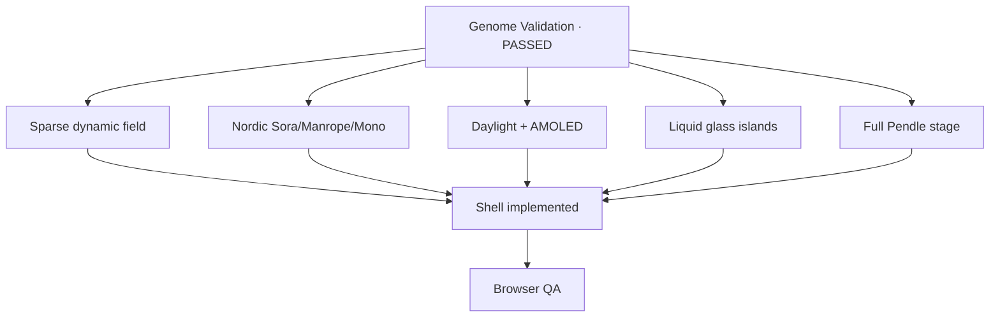

# Design Brain — Creance

| Meta | Value |
| :--- | :--- |
| Project | Creance — Mandate Control Plane |
| Updated | 2026-09-18 |
| Genome status | **validated** (+ layout/type/AMOLED/glass overrides) |
| Genome Validation | **PASSED** |
| Phase | polish / sparse field |
| Interim UI | Cold Vault → sparse dynamic field |

---

## Locked decisions (user-validated + overrides)

| ID | Decision |
| :--- | :--- |
| Q1 | Solemn vault |
| Q2 | Refine Cold Vault |
| Q3 | Vault gate metaphor |
| Q4 | Dual theme — daylight + **AMOLED** dark (green tinge) |
| Q5 | Oxide reject + verdant pass |
| Q6 | **Nordic:** Sora + Manrope + JetBrains Mono |
| Q7 | Light 2.5D atmosphere (no WebGL) |
| Q8 | Restrained choreography |
| Q9 | **Symmetric centered field** (equal 2-col, ~1160px) |
| Q10 | Full-stage Pendle |
| Extra | Liquid glass islands; Creance vault-gate logo |

---

## Decision tree

---

## Live data binding

- Verdict `#reasonBox` / `#policyCodeLabel` / `#reasonTx` ← evaluate/approve + `txHash`
- Pendle ← `PENDLE_PT_USDC` → `YIELD_005` + proof
- Audit `#auditList` ← `log.events[]` with hashes when gateway attaches them
